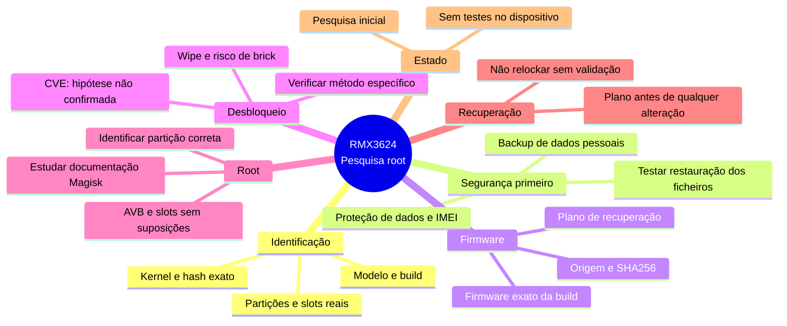

# Mapa mental — RMX3624 / Realme C33

```mermaid
mindmap
  root((RMX3624<br/>Pesquisa root))
    Identificação
      Modelo e build
      Kernel e hash exato
      Partições e slots reais
    Segurança primeiro
      Backup de dados pessoais
      Testar restauração dos ficheiros
      Proteção de dados e IMEI
    Firmware
      Firmware exato da build
      Origem e SHA256
      Plano de recuperação
    Desbloqueio
      Verificar método específico
      CVE: hipótese não confirmada
      Wipe e risco de brick
    Root
      Identificar partição correta
      Estudar documentação Magisk
      AVB e slots sem suposições
    Recuperação
      Plano antes de qualquer alteração
      Não relockar sem validação
    Estado
      Pesquisa inicial
      Sem testes no dispositivo
```

[Voltar ao README](README.md)
